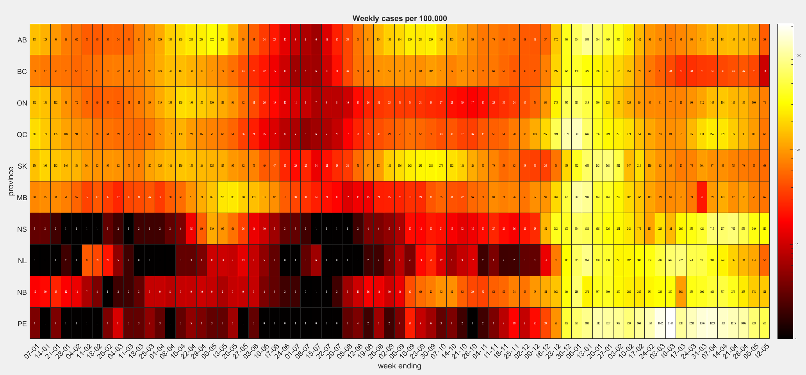

# COVID-19-Canada-heatmaps
*These graphs are provided to the public for educational and academic research purposes. If you would like to use them, please cite as: Karaivanov, Lu and Shigeoka (2021), SFU Economics COVID-19 Research Team, github.com/C19-SFU-Econ.*

